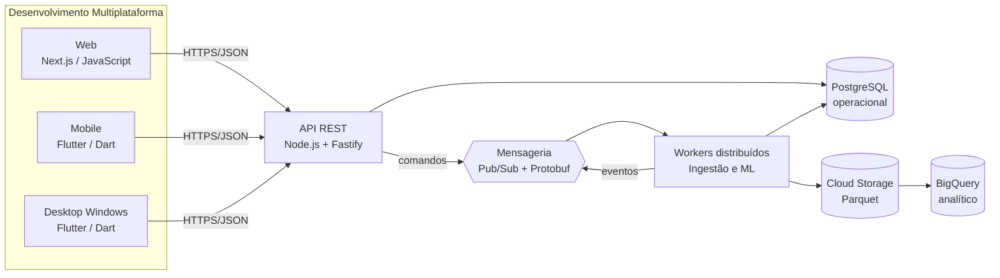

# Alinhamento acadêmico do projeto

Este documento transforma os objetivos das três disciplinas em decisões técnicas e evidências verificáveis do **Estoque Inteligente**. A matriz também evita que algum requisito acadêmico fique implícito ou seja tratado apenas ao final do semestre.

## Objetivo geral

Desenvolver um software multiplataforma de gestão inteligente de estoque, integrado ao Bling, que disponibilize aplicações Web, Mobile e Desktop, uma API construída com framework, comunicação distribuída por mensagens, armazenamento operacional e analítico e técnicas de mineração para classificação, agrupamento e previsão de demanda.

## Matriz de rastreabilidade

| Disciplina e competência | Aplicação no projeto | Tecnologia/abordagem | Evidência atual | Próxima evidência |
| --- | --- | --- | --- | --- |
| Linguagens para Web, Mobile e Desktop | três experiências acessando a mesma API | JavaScript/Next.js; Dart/Flutter para Android, iOS e Windows | `apps/web` e `apps/mobile` | builds instaláveis e testes das jornadas |
| Back-end Web por framework | API REST versionada | Node.js + Fastify + OpenAPI | `apps/api`, `/health` e `/docs` | persistência PostgreSQL e autenticação |
| Sistemas distribuídos | API, ingestão e mineração implantados e escalados separadamente | contêineres stateless, eventos, idempotência e consistência eventual | arquitetura de contêineres e sequência | prova de processamento distribuído |
| Protocolos de mensageria | comandos e eventos desacoplam API, ingestão e ML | Google Pub/Sub; gRPC/HTTPS; payload Protobuf | catálogo de tópicos e arquivos `.proto` | publisher, subscriber e DLQ funcionando |
| Armazenamento em grande escala | separar carga transacional da analítica | PostgreSQL operacional; Parquet no Cloud Storage; BigQuery analítico | modelo lógico e arquitetura de dados | carga particionada e consulta medida |
| Desenvolvimento Dirigido a Testes | cada regra nasce de um teste falho | ciclo vermelho–verde–refatorar e pirâmide de testes | testes da API e Flutter; estratégia documentada | cobertura das regras ABC/XYZ e reposição |
| Controle de versionamento | trabalho colaborativo e rastreável | GitHub Flow, revisão por pull request e commits convencionais | repositório Git e política documentada | proteção da `main` e CI obrigatória |
| Criar ambiente em nuvem com alta disponibilidade | serviços regionais, redundância e recuperação | Cloud Run, Cloud SQL HA, Pub/Sub, Storage e Monitoring | topologia alvo documentada | ambiente de homologação provisionado |
| Migrar Data Center Local para nuvem | migrar PostgreSQL e jobs sem interrupção indevida | inventário, DMS/CDC, validação, corte e retorno | plano de migração documentado | ensaio com base de homologação |
| Arquitetura confiável, segura, eficiente e econômica | requisitos NFR, menor privilégio e orçamento | IAM, Secret Manager, backups, autoscaling, alertas e FinOps | decisões e critérios documentados | teste de restauração e relatório de custos |
| Fases de Mineração de Dados | executar o ciclo completo do problema à operação | CRISP-DM, perfil, preparação, treino, avaliação e monitoramento | plano de mineração | dataset versionado e relatório experimental |
| Técnicas e ferramentas de IA | transformar histórico em apoio à compra | Python, modelos temporais, clustering e classificação | algoritmos candidatos e métricas | notebooks/jobs reproduzíveis e modelos aprovados |
| Aprendizado supervisionado | prever variável-alvo ou risco com rótulo conhecido | regressão temporal e futura classificação de ruptura | hipótese, rótulos e métricas definidos | baseline versus modelos treinados |
| Aprendizado não supervisionado | descobrir segmentos e regularidade sem rótulo | K-Means/hierárquico/HDBSCAN e ABC/XYZ | atributos e avaliação definidos | clusters interpretados pelo negócio |

## Arquitetura por responsabilidade acadêmica

## Critério de conclusão do semestre

O projeto só será considerado multiplataforma quando uma mesma jornada mínima — autenticar, consultar produto, visualizar previsão e acompanhar risco de ruptura — funcionar em Web, Mobile e Desktop usando contratos compartilhados da API. A demonstração distribuída deverá provar publicação, consumo, repetição segura de mensagem e tratamento de falha. A mineração deverá apresentar dados, método, separação temporal, baseline, métricas e resultado reproduzível.
