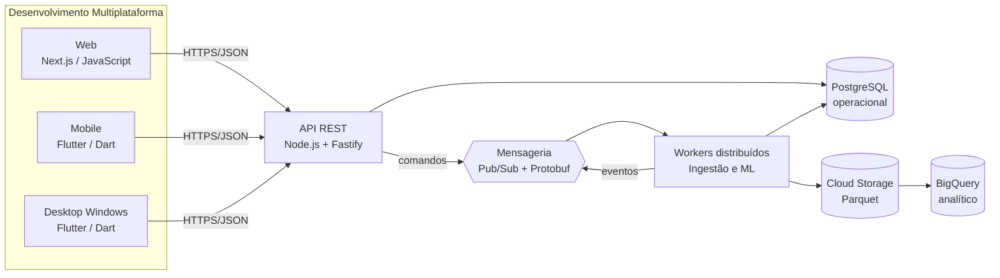

# Alinhamento acadêmico do projeto

Este documento transforma os objetivos das três disciplinas em decisões técnicas e evidências verificáveis do **Estoque Inteligente**. A matriz também evita que algum requisito acadêmico fique implícito ou seja tratado apenas ao final do semestre.

## Objetivo geral

Desenvolver um software multiplataforma de gestão inteligente de estoque alimentado por uma base pública versionada, com aplicações Web, Mobile e Desktop, API construída com framework, comunicação distribuída por mensagens, armazenamento operacional e analítico e técnicas de mineração para classificação, agrupamento e previsão de demanda.

## Matriz de rastreabilidade

| Disciplina e competência | Aplicação no projeto | Tecnologia/abordagem | Evidência atual | Próxima evidência |
| --- | --- | --- | --- | --- |
| Linguagens para Web, Mobile e Desktop | três experiências acessando a mesma API | JavaScript/Next.js; Dart/Flutter para Android, iOS e Windows | `apps/web` e `apps/mobile` | builds instaláveis e testes das jornadas |
| Back-end Web por framework | API REST versionada | Node.js + Fastify + OpenAPI | `apps/api`, `/health` e `/docs` | persistência PostgreSQL e autenticação |
| Sistemas distribuídos | API, ingestão e mineração executados separadamente | contêineres stateless, outbox, idempotência e consistência eventual | API, jobs Python e worker de outbox | implantação e prova de carga distribuída |
| Protocolos de mensageria | eventos desacoplam API e consumidores | Google Pub/Sub; gRPC/HTTPS; payload Protobuf | `.proto`, encoder e publisher concorrente funcionando | assinatura idempotente e ensaio de DLQ |
| Armazenamento em grande escala | separar carga transacional da analítica | PostgreSQL particionado; Parquet no Cloud Storage; BigQuery analítico | mais de 1 milhão de fatos particionados e carga por `COPY` | Parquet/BigQuery e consulta medida |
| Desenvolvimento Dirigido a Testes | cada regra nasce de um teste falho | ciclo vermelho–verde–refatorar e pirâmide de testes | testes unitários, PostgreSQL real, ML, Web e Flutter na CI | aumentar cenários de backtesting |
| Controle de versionamento | trabalho colaborativo e rastreável | GitHub Flow, revisão por pull request e commits convencionais | repositório Git e política documentada | proteção da `main` e CI obrigatória |
| Criar ambiente em nuvem com alta disponibilidade | serviços regionais, redundância e recuperação | Cloud Run, Cloud SQL HA, Pub/Sub, Storage e Monitoring | topologia alvo documentada | ambiente de homologação provisionado |
| Migrar Data Center Local para nuvem | migrar PostgreSQL e jobs sem interrupção indevida | inventário, DMS/CDC, validação, corte e retorno | plano de migração documentado | ensaio com base de homologação |
| Arquitetura confiável, segura, eficiente e econômica | requisitos NFR, menor privilégio e orçamento | IAM, Secret Manager, backups, autoscaling, alertas e FinOps | decisões e critérios documentados | teste de restauração e relatório de custos |
| Fases de Mineração de Dados | executar o ciclo completo do problema à operação | CRISP-DM, perfil, preparação, treino, avaliação e publicação | dataset/versionamento, regras e métricas no banco | monitoramento de drift |
| Técnicas e ferramentas de IA | transformar histórico em apoio à compra | Python, scikit-learn, clustering, classificação e regressão temporal | jobs reproduzíveis e artefatos versionados | comparação com novos algoritmos |
| Aprendizado supervisionado | prever demanda e alta demanda futura | Random Forest e HistGradientBoosting com corte temporal | F1 0,960 e WAPE 0,897, ambos persistidos | backtesting com múltiplas janelas |
| Aprendizado não supervisionado | descobrir segmentos sem rótulo | K-Means escalado e seleção por silhouette | 2 clusters, silhouette 0,359 e ABC/XYZ | interpretação e política por cluster |

## Arquitetura por responsabilidade acadêmica

## Critério de conclusão do semestre

O projeto só será considerado multiplataforma quando uma mesma jornada mínima — autenticar, consultar produto, visualizar previsão e acompanhar risco de ruptura — funcionar em Web, Mobile e Desktop usando contratos compartilhados da API. A demonstração distribuída deverá provar publicação, consumo, repetição segura de mensagem e tratamento de falha. A mineração deverá apresentar dados, método, separação temporal, baseline, métricas e resultado reproduzível.
