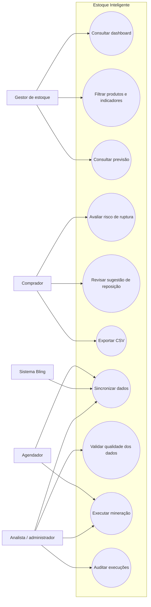
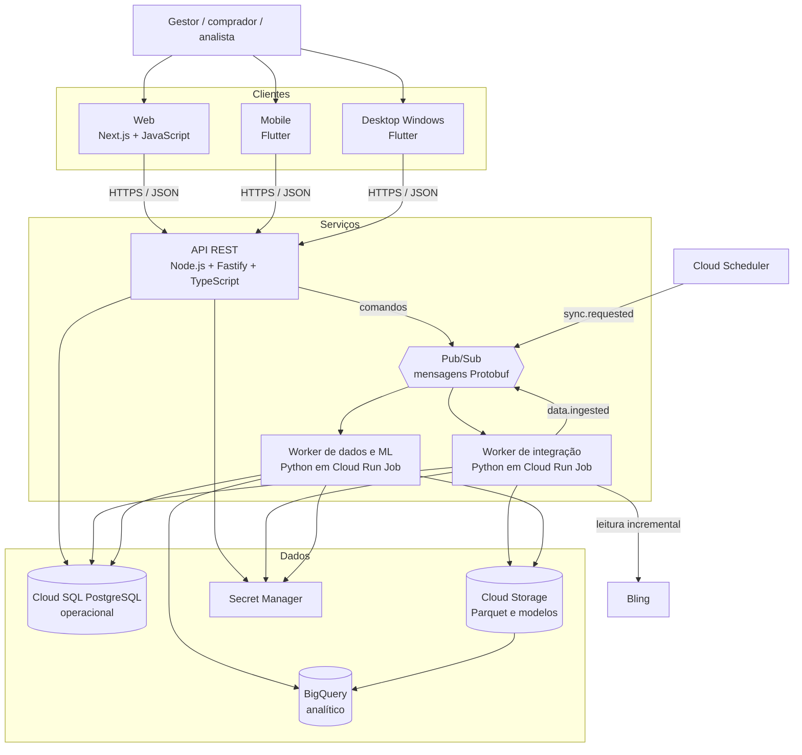
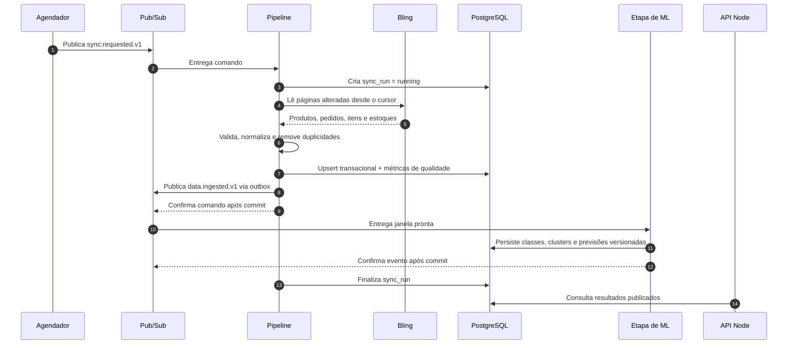

# Modelagem inicial e arquitetura

## 1. Casos de uso

## 2. Arquitetura de contêineres

### Responsabilidades

| Componente | Responsabilidade | Decisão inicial |
| --- | --- | --- |
| Web | dashboard, filtros, visualizações e administração | Next.js 16 com App Router, JavaScript, shadcn/ui e Recharts |
| API | autenticação, regras, contratos e acesso aos resultados | Node.js, TypeScript e Fastify 5; OpenAPI em `/docs` |
| Mobile | consultas e alertas prioritários | Flutter 3.41+ para Android e iOS |
| Desktop | jornadas principais em telas grandes | Flutter para Windows, com layout adaptativo |
| Pipeline | ingestão, qualidade, atributos, treino e inferência | Python, bibliotecas de dados e execução em lote |
| Broker | desacoplar comandos e eventos entre serviços | Pub/Sub por gRPC/HTTPS, esquema Protobuf e DLQ |
| PostgreSQL | fonte operacional consolidada | esquema relacional, integridade e resultados publicados |
| Cloud Storage | lago de dados e artefatos | Parquet particionado por data/fonte, objetos versionados e criptografados |
| BigQuery | histórico analítico e preparação em escala | tabelas particionadas e clusterizadas, cobrança por consulta controlada |

## 3. Sistemas distribuídos e mensageria

### Catálogo inicial de mensagens

| Tópico | Produtor | Consumidor | Finalidade |
| --- | --- | --- | --- |
| `inventory.sync.requested.v1` | Scheduler ou API | worker de integração | solicitar carga diária ou manual |
| `inventory.data.ingested.v1` | worker de integração | worker de qualidade/ML | informar que uma janela consistente foi persistida |
| `inventory.model.requested.v1` | pipeline ou analista | worker de ML | solicitar treino ou inferência versionada |
| `inventory.model.completed.v1` | worker de ML | API/worker de alertas | publicar métricas e versão aprovada/rejeitada |
| `inventory.alert.generated.v1` | worker de alertas | notificações e auditoria | distribuir risco de ruptura calculado |
| `inventory.dead-letter.v1` | assinaturas com falha | operador/reprocessador | preservar mensagens não processadas |

O transporte gerenciado será Google Pub/Sub. Publicação e consumo interno podem usar gRPC; assinaturas push usam HTTPS. Os payloads seguem Protocol Buffers e o envelope comum definido em [`../infra/messaging/inventory_events.proto`](../infra/messaging/inventory_events.proto).

### Garantias adotadas

- entrega tratada como **pelo menos uma vez**, mesmo que uma assinatura específica ofereça garantias adicionais;
- `message_id`, `correlation_id`, versão do evento e instante UTC em todo envelope;
- consumidores idempotentes registram a combinação consumidor + mensagem antes de confirmar o processamento;
- transação de negócio e evento usam padrão **Transactional Outbox**, evitando alteração salva sem publicação correspondente;
- retentativa com espera exponencial e limite; depois disso a mensagem segue para DLQ;
- eventos são compatíveis para trás dentro da mesma versão principal e o esquema é validado antes da publicação;
- consistência eventual é visível ao usuário pela data da última atualização;
- logs e métricas carregam o mesmo `correlation_id` para rastrear uma operação entre serviços.

## 4. Fluxo da atualização diária

Em caso de falha, o cursor só avança após a persistência bem-sucedida. Uma nova execução reutiliza identificadores externos e chaves únicas, evitando duplicidade.

## 5. Contrato inicial da API

| Método e rota | Uso | Situação na sprint 1 |
| --- | --- | --- |
| `GET /health` | saúde da aplicação | implementado |
| `GET /api/v1/dashboard/summary` | KPIs e resumo do painel | implementado com PostgreSQL |
| `GET /api/v1/products` | lista filtrável de produtos | implementado com PostgreSQL |
| `GET /api/v1/forecasts` | série prevista e limites | implementado com PostgreSQL |
| `GET /api/v1/sync-runs` | histórico de sincronizações | implementado com PostgreSQL |
| `POST /api/v1/integrations/bling/sync` | solicitar sincronização manual | contrato planejado; exige autorização |

Os contratos navegáveis ficam em `/docs`. As rotas usam um repositório
PostgreSQL injetado nos serviços de aplicação; os testes usam uma implementação
em memória do mesmo contrato.

## 6. Decisões de projeto

- API e clientes permanecem desacoplados para atender web, Flutter mobile e Flutter desktop.
- O Node.js não executará treinamento pesado no processo da API; jobs de dados usam Python e escalam separadamente.
- Dados externos entram por uma camada de adaptação, impedindo que formatos do Bling contaminem o domínio.
- Resultados de mineração são persistidos com versão, métricas e período de treinamento.
- PostgreSQL atende transações; Cloud Storage/BigQuery recebem o volume histórico analítico.
- Comandos longos retornam rapidamente e são processados por mensagens, sem manter a requisição HTTP aberta.
- O primeiro protótipo não simula uma integração real: dados de demonstração são rotulados como tal.
