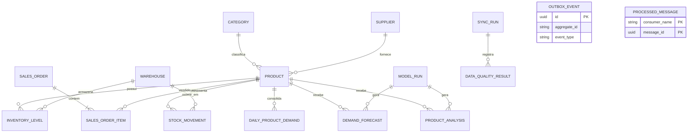

# Banco de dados — modelos conceitual e lógico

## 1. Objetivo e premissas

O PostgreSQL será a fonte consolidada consumida pela API e pelos jobs de mineração. Identificadores externos são preservados para permitir `upsert` e auditoria, mas as relações internas usam UUID. Valores monetários usam `numeric`, datas de eventos usam `timestamptz` e quantidades aceitam casas decimais.

As cardinalidades e volumes abaixo são **estimativas de projeto**, não estatísticas observadas. Devem ser substituídos após uma extração piloto autorizada.

## 2. Modelo conceitual

## 3. Entidades e volume inicial estimado

| Entidade | Grão | Crescimento estimado | Retenção inicial |
| --- | --- | ---: | --- |
| `categories` | uma categoria do catálogo | 50–500 total | enquanto referenciada |
| `suppliers` | um fornecedor | 100–2.000 total | enquanto referenciado |
| `products` | um SKU/produto | 1.000–20.000 total | histórico de inativados |
| `warehouses` | um depósito | 1–20 total | permanente |
| `inventory_levels` | produto × depósito atual | até 400 mil | somente posição atual |
| `sales_orders` | um pedido de venda | 100 mil–1 milhão/ano | mínimo de 5 anos |
| `sales_order_items` | um item de pedido | 300 mil–5 milhões/ano | mínimo de 5 anos |
| `stock_movements` | uma movimentação | 500 mil–10 milhões/ano | mínimo de 2 anos |
| `daily_product_demand` | produto × dia | 365 mil–7,3 milhões/ano | mínimo de 5 anos |
| `demand_forecasts` | produto × data-alvo × execução | depende do horizonte | 2 anos ou por versão aprovada |
| `product_analyses` | produto × execução de modelo | dezenas de milhares/mês | 2 anos |
| `sync_runs` | uma execução de integração | ~365/ano + manuais | 2 anos |
| `outbox_events` | um evento de domínio a publicar | proporcional às alterações | remover após retenção de auditoria |
| `processed_messages` | uma mensagem × consumidor | proporcional aos eventos | superior à maior janela de reentrega |

Para os maiores volumes, a necessidade de particionamento mensal será decidida após medir tamanho e planos de consulta; não será aplicada prematuramente.

## 4. Qualificação dos principais campos analíticos

| Campo | Tipo lógico | Natureza estatística | Unidade/escala | Origem | Uso |
| --- | --- | --- | --- | --- | --- |
| `product_id` | UUID | qualitativa nominal | identificador | interno | chave de agrupamento |
| `external_id` | texto | qualitativa nominal | identificador | Bling | deduplicação e rastreio |
| `sku` | texto | qualitativa nominal | código | Bling | busca e integração |
| `category_id` | UUID | qualitativa nominal | categoria | Bling/interno | filtro e atributo do produto |
| `active` | booleano | qualitativa nominal dicotômica | sim/não | Bling | filtro da população |
| `cost_price` | decimal | quantitativa contínua, razão | BRL | Bling | valor de consumo/ABC |
| `sale_price` | decimal | quantitativa contínua, razão | BRL | Bling/pedido | receita e atributos |
| `lead_time_days` | inteiro | quantitativa discreta, razão | dias | cadastro complementar | ponto de reposição |
| `quantity` | decimal | quantitativa contínua, razão | unidade do produto | pedido/movimento | demanda e estoque |
| `sold_at` | data-hora | temporal | UTC | Bling | ordenação da série |
| `status` | texto controlado | qualitativa nominal | situação | Bling | exclusão de cancelados |
| `available_quantity` | decimal derivado | quantitativa contínua, razão | unidade do produto | estoque − reservado | risco de ruptura |
| `demand_date` | data | temporal | dia | derivado | índice da série temporal |
| `units_sold` | decimal derivado | quantitativa contínua, razão | unidades/dia | itens válidos | variável-alvo |
| `orders_count` | inteiro derivado | quantitativa discreta, razão | pedidos/dia | pedidos válidos | densidade da demanda |
| `abc_class` | caractere | qualitativa ordinal | A, B ou C | modelo/regras | prioridade econômica |
| `xyz_class` | caractere | qualitativa ordinal | X, Y ou Z | modelo/regras | regularidade |
| `cluster_label` | inteiro/texto | qualitativa nominal | grupo | modelo | segmento comportamental |
| `predicted_quantity` | decimal | quantitativa contínua, razão | unidades | modelo | demanda esperada |
| `lower_bound`/`upper_bound` | decimal | quantitativa contínua, razão | unidades | modelo | incerteza da previsão |
| `wape` | decimal | quantitativa contínua, razão | proporção | avaliação | comparação de modelos |

Campos de cliente (nome, documento, e-mail e endereço) não integram o conjunto mínimo. Caso alguma análise futura exija dimensão geográfica, será usada região agregada e sem identificação direta.

## 5. Dicionário das entidades lógicas

| Tabela | Chave/relacionamentos | Campos essenciais |
| --- | --- | --- |
| `categories` | PK `id`; única `external_id` | nome, ativa, timestamps |
| `suppliers` | PK `id`; única `external_id` | nome, ativo, timestamps |
| `products` | PK `id`; FK categoria/fornecedor; únicos `external_id` e `sku` | nome, preços, lead time, estoque mínimo, ativo |
| `warehouses` | PK `id`; única `external_id` | nome, ativo |
| `inventory_levels` | PK composta produto/depósito | em mãos, reservado, data da posição |
| `sales_orders` | PK `id`; única `external_id` | número, data, status, canal, valor total |
| `sales_order_items` | PK `id`; FK pedido/produto; única pedido + sequência | quantidades, preços, desconto e total |
| `stock_movements` | PK `id`; FKs produto/depósito | tipo, quantidade com sinal, data e referência |
| `daily_product_demand` | PK composta produto/data | unidades, receita, pedidos, indicador de ruptura |
| `model_runs` | PK `id` | tarefa, algoritmo, versão, período, estado e métricas JSON |
| `demand_forecasts` | PK `id`; FKs produto/modelo | data-alvo, horizonte, previsão e intervalo |
| `product_analyses` | PK `id`; FKs produto/modelo | classes ABC/XYZ, cluster e atributos JSON |
| `sync_runs` | PK `id` | fonte, cursor, estado, contagens e erro sanitizado |
| `data_quality_results` | PK `id`; FK sincronização | regra, severidade, aprovados/reprovados e amostra sanitizada |
| `outbox_events` | PK `id`; índice em eventos não publicados | agregado, tipo, versão, payload, correlação e estado de publicação |
| `processed_messages` | PK composta consumidor/mensagem | instante e correlação; garante idempotência do consumidor |

O modelo físico executável, com restrições e índices, está em [`../infra/database/schema.sql`](../infra/database/schema.sql).

## 6. Plano de estatística e perfil dos dados

Após receber a amostra, o notebook/rotina de perfil deverá produzir:

1. contagem total, distintos, nulos, zeros e duplicados por campo;
2. mínimo, máximo, média, mediana, desvio-padrão, quartis e percentis 95/99 para campos quantitativos;
3. frequência absoluta e relativa das categorias e estados;
4. intervalo temporal, dias ausentes e frequência de vendas por produto;
5. integridade entre pedido, item, produto e depósito;
6. valores inválidos: quantidade negativa sem devolução, preço abaixo de zero e datas futuras;
7. cobertura de custo, fornecedor, categoria e prazo de reposição;
8. distribuição do histórico disponível por produto;
9. taxa de ruptura e possível demanda censurada;
10. relatório comparativo entre carga atual e carga anterior para detectar mudança de esquema ou distribuição.

### Critérios provisórios de prontidão

- 100% dos itens de pedido válidos ligados a um produto conhecido;
- duplicidade de identificador externo igual a zero;
- menos de 1% de preços ausentes nos itens válidos;
- pelo menos 180 dias de observação para previsão individual; abaixo disso, usar estratégia por grupo;
- campos críticos (`external_id`, produto, data e quantidade) sem nulos.

Esses limites serão revisados com evidência depois da primeira carga piloto.

## 7. Separação operacional e analítica

O PostgreSQL não será usado como data lake. Pedidos, saldos, estados de execução e resultados publicados permanecem no banco operacional. Snapshots brutos autorizados e séries de grande volume seguem para Cloud Storage em Parquet, particionados por data de ingestão; BigQuery consulta a camada curada para perfil, treinamento e backtesting. Essa separação evita que leituras históricas concorram com as consultas da API.

As tabelas `outbox_events` e `processed_messages` dão suporte à mensageria: a primeira garante publicação posterior de um evento salvo na mesma transação da regra de negócio; a segunda impede que uma mensagem reentregue produza o mesmo efeito duas vezes.
