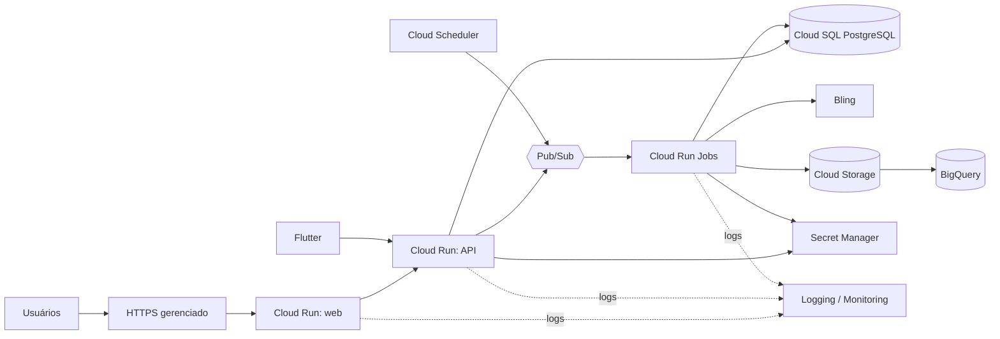
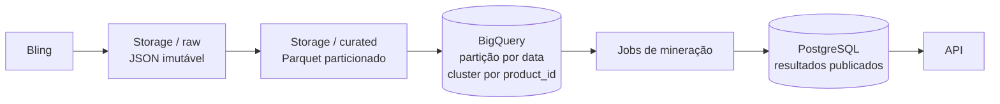

# Computação em Nuvem II — serviços e justificativas

## 1. Proposta

A arquitetura alvo usa serviços gerenciados do **Google Cloud** e mantém o desenvolvimento local com contêineres. A escolha concentra API, processamento, banco, agendamento, artefatos e observabilidade em um provedor, reduzindo integrações operacionais na fase acadêmica.

| Necessidade | Serviço proposto | Justificativa |
| --- | --- | --- |
| Front-end Next.js | Cloud Run, contêiner com saída standalone | executa o mesmo artefato local/nuvem, HTTPS e escala a zero |
| API Node.js | Cloud Run | adequado a HTTP stateless, revisão por versão e cobrança por uso |
| Jobs de ingestão e ML | Cloud Run Jobs | suporta tarefas em lote, dependências Python e tempo maior que uma função curta |
| Banco relacional | Cloud SQL for PostgreSQL | transações, integridade, backup gerenciado e compatibilidade com PostgreSQL local |
| Arquivos brutos e modelos | Cloud Storage | objetos baratos, versionamento, retenção e ciclo de vida |
| Agendamento diário | Cloud Scheduler | expressão de horário auditável e chamada autenticada do job |
| Mensageria distribuída | Pub/Sub | desacopla produtores e consumidores, suporta retentativa, assinaturas independentes e DLQ |
| Análise em grande escala | BigQuery | data warehouse serverless, armazenamento colunar e separação entre computação e armazenamento |
| Segredos | Secret Manager | rotação e acesso por identidade, sem tokens em código ou imagem |
| Imagens dos serviços | Artifact Registry | registro privado integrado à implantação no Cloud Run |
| Logs e métricas | Cloud Logging e Monitoring | centraliza erros, duração, volume e alertas de sincronização |
| CI/CD | GitHub Actions + Workload Identity Federation | testes e deploy sem chave de serviço permanente no GitHub |

## 2. Topologia de implantação

## 3. Segurança

- contas de serviço separadas para web, API e job, com menor privilégio;
- Cloud SQL sem exposição pública direta e conexão autenticada;
- credenciais do Bling e banco no Secret Manager;
- TLS em todos os acessos externos;
- dados pessoais não necessários descartados na ingestão;
- logs sem tokens, documentos, e-mails ou cargas completas;
- ambientes `dev`, `staging` e `prod` separados ao menos por projeto ou por recursos e identidades;
- trilha de auditoria e revisão periódica das permissões.

## 4. Alta disponibilidade e confiabilidade

### Ambiente produtivo alvo

- Cloud Run regional com múltiplas instâncias, concorrência medida, mínimo de uma instância para a API crítica e limite máximo para proteger custo e banco;
- Cloud SQL PostgreSQL em configuração regional de alta disponibilidade, com primário e standby em zonas diferentes e failover automático;
- backups automatizados, recuperação pontual e ensaio periódico de restauração;
- Pub/Sub desacoplando picos e indisponibilidades temporárias, com retentativas, política de ack e tópico de mensagens não processáveis;
- Cloud Storage regional ou birregional conforme custo/RPO, com versionamento e ciclo de vida;
- verificações de saúde, timeouts, circuit breaker no adaptador externo e implantação gradual por revisões do Cloud Run;
- alertas para taxa de erro, latência, backlog, mensagens em DLQ, falha de job, uso do banco e degradação do modelo.

O ambiente acadêmico pode usar Cloud SQL de zona única e escala mínima zero para economizar. A topologia HA deve ser criada e demonstrada em homologação ou documentada por infraestrutura como código antes da entrega final; produção não herdará a configuração econômica sem uma decisão explícita.

### Objetivos operacionais iniciais

| Indicador | Meta |
| --- | --- |
| Disponibilidade mensal da consulta | 99,9% no ambiente produtivo |
| RPO do banco | até 15 minutos com PITR habilitado |
| RTO | até 60 minutos, validado em ensaio |
| Processamento diário | concluído até 08:00 no fuso de São Paulo |
| Mensagem sem processamento | zero perda; mensagem preservada em DLQ após retentativas |

## 5. Armazenamento de dados em escala

- **PostgreSQL/Cloud SQL:** dados normalizados necessários à API, integridade, estados e resultados vigentes;
- **Cloud Storage:** zonas `raw`, `validated` e `curated`; formato Parquet para reduzir leitura e preservar snapshots reproduzíveis;
- **BigQuery:** séries históricas e atributos de treino, tabelas particionadas por data e clusterizadas por produto/categoria;
- **Política de consulta:** selecionar colunas e períodos necessários, exigir filtro de partição e aplicar cotas/limites de bytes;
- **Ciclo de vida:** mover snapshots antigos para classe mais econômica e excluir apenas conforme política aprovada;
- **Linagem:** todo lote carrega `sync_run_id`, versão do esquema, origem e instante de ingestão.

## 6. Migração da estrutura local para nuvem

| Fase | Atividade | Critério de avanço/retorno |
| --- | --- | --- |
| 1. Descoberta | inventariar banco, arquivos, jobs, dependências, volume, SLA e dados sensíveis | inventário e responsáveis aprovados |
| 2. Preparação | criar rede, IAM, segredos, Cloud SQL, Storage, BigQuery e observabilidade em homologação | infraestrutura reproduzível e sem acesso público ao banco |
| 3. Carga inicial | migrar esquema e snapshot PostgreSQL; copiar dados brutos autorizados | contagens, hashes e restrições reconciliados |
| 4. Sincronização | usar Database Migration Service/CDC quando houver origem PostgreSQL ativa | atraso de replicação abaixo do limite definido |
| 5. Validação | comparar consultas, desempenho, segurança, backup e processamento ponta a ponta | aceite técnico e de negócio |
| 6. Corte | congelar escrita local, aplicar delta, trocar configuração e observar | plano de retorno ainda disponível |
| 7. Estabilização | monitorar erros, custos, latência e integridade; desativar origem após retenção | período sem divergências críticas |

Como a fonte Bling é SaaS, ela não será “migrada”: seu acesso passa a ser feito pelo worker em nuvem. O plano de migração aplica-se ao PostgreSQL, arquivos e rotinas que forem desenvolvidos ou operados localmente.

## 7. Disponibilidade, backup e custo

- instâncias do Cloud Run começam com escala mínima zero em desenvolvimento;
- limites de instâncias impedem aumento acidental de custo;
- orçamento e alertas de 50%, 80% e 100% devem ser configurados antes do deploy;
- banco inicialmente pequeno, com backup diário e recuperação pontual quando o ambiente virar produção;
- bucket possui política de ciclo de vida: bruto para classe mais barata após 30 dias e exclusão conforme retenção aprovada;
- em produção, Cloud SQL HA e PITR atendem os objetivos definidos; em desenvolvimento, ficam desligados para controlar custo;
- reservas/capacidade do BigQuery só serão usadas quando o consumo medido justificar; inicialmente será cobrança sob demanda com limite.

## 8. Etapas de adoção

1. **Sprint inicial:** execução local, contratos, protótipo e modelo PostgreSQL.
2. **Integração:** projeto de nuvem, Secret Manager, banco de homologação e carga piloto.
3. **Automação:** imagens, Artifact Registry, Pub/Sub, Cloud Run Jobs e Scheduler.
4. **Escala analítica:** zonas do lago, Parquet, BigQuery particionado e consultas de treinamento.
5. **Operação:** alertas, painéis, política de backup, ensaio de restauração e custos medidos.

## 9. Alternativa e reversibilidade

Os componentes são portáveis: contêineres OCI, PostgreSQL e armazenamento por objetos. Se créditos, exigências da disciplina ou experiência da equipe indicarem outro provedor, a API e os jobs permanecem iguais; apenas os adaptadores de segredo, agendamento e implantação mudam.

## 10. Referências oficiais consultadas

- [Visão geral e comparação entre serviços e jobs do Cloud Run](https://docs.cloud.google.com/run/docs/resource-model)
- [Autoescalabilidade e escala a zero no Cloud Run](https://docs.cloud.google.com/run/docs/about-instance-autoscaling)
- [Recuperação pontual do Cloud SQL for PostgreSQL](https://docs.cloud.google.com/sql/docs/postgres/backup-recovery/pitr)
- [Agendamentos recorrentes no Cloud Scheduler](https://docs.cloud.google.com/scheduler/docs/configuring/cron-job-schedules)
- [Visão geral do Secret Manager](https://docs.cloud.google.com/secret-manager/docs/overview)
- [Gerenciamento do ciclo de vida de objetos no Cloud Storage](https://docs.cloud.google.com/storage/docs/managing-lifecycles)
- [Visão geral do Pub/Sub](https://docs.cloud.google.com/pubsub/docs/pubsub-basics)
- [Retentativas e dead-letter topics no Pub/Sub](https://docs.cloud.google.com/pubsub/docs/handling-failures)
- [Visão geral do BigQuery](https://docs.cloud.google.com/bigquery/docs/introduction)
- [Alta disponibilidade do Cloud SQL for PostgreSQL](https://docs.cloud.google.com/sql/docs/postgres/high-availability)
- [Migração contínua de PostgreSQL com Database Migration Service](https://docs.cloud.google.com/database-migration/docs/postgres/migration-types)
