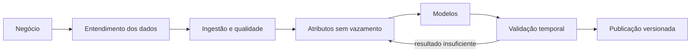

# Mineração de dados — base, execução e avaliação

## Fonte oficial

O projeto usa a [Online Retail II](https://doi.org/10.24432/C5CG6D), publicada
por Daqing Chen no UCI Machine Learning Repository. A licença **CC BY 4.0**
permite compartilhar e adaptar a base para qualquer finalidade, inclusive
profissional/comercial, desde que a atribuição seja mantida.

| Propriedade | Valor verificado |
| --- | --- |
| Arquivo | `online_retail_II.xlsx` |
| Período | 01/12/2009 a 09/12/2011 |
| Linhas lidas | 1.067.371 |
| Vendas válidas carregadas | 1.003.744 |
| Produtos elegíveis | 4.737 |
| SHA-256 | `bcbe73b35f5b7babf197fb0cb983a11f5d9ff929078d4aa53d171b1f2df2e980` |
| Moeda | GBP |

O download é feito diretamente da UCI por `npm run data:download`. O arquivo
bruto não é versionado no Git. Sua URL, versão, hash, licença, intervalo,
contagens e resumo de qualidade ficam em `dataset_versions`.

### Privacidade e limitações

O campo `Customer ID` é contado para análise de completude, mas **não é
armazenado**. Cancelamentos, duplicidades, preços/quantidades inválidos e códigos
que não representam mercadorias são preservados no fato bruto desidentificado e
excluídos da demanda válida conforme regras auditáveis.

A fonte não contém custo, saldo físico, lead time ou ruptura. Esses atributos
não podem ser inferidos como verdade. Para a demonstração operacional, um
depósito chamado `Depósito simulado (UCI)` recebe saldo inicial determinístico;
custo e estoque mínimo são marcados/documentados como simulações. Venda
observada também pode subestimar demanda quando houve falta de estoque.

## Processo reproduzível (CRISP-DM)



```powershell
npm run db:start
npm run db:migrate
py -m venv .venv
npm run ml:setup
npm run data:setup
```

A carga usa `COPY`, uma tabela temporária, transação única e chaves de origem.
Reexecutar o comando com o mesmo hash não duplica dados. Os fatos de venda são
particionados por ano em `retail_sales_facts`; séries diárias agregadas ficam em
`daily_product_demand`. Essa separação reduz leitura e custo para os modelos.

## Técnicas implementadas

### Classificação por regras: ABC/XYZ

- ABC usa participação acumulada na receita: A até 80%, B até 95%, C restante;
- XYZ usa coeficiente de variação e proporção de dias sem venda;
- a matriz combinada permite orientar níveis de serviço e prioridade.

### Aprendizado não supervisionado

K-Means usa unidades, receita, média diária, coeficiente de variação, proporção
de zeros e preço médio. Grandezas assimétricas recebem `log1p`, e os atributos
são padronizados. O número de grupos entre 2 e 6 é escolhido pelo maior
silhouette score, com `random_state=42`.

Resultado da execução atual: **2 clusters**, silhouette **0,358661**.

### Aprendizado supervisionado — classificação

Uma Random Forest prevê se o produto terá alta demanda no terço final do
histórico usando somente atributos calculados nos dois primeiros terços. A
separação de produtos para teste é estratificada e reprodutível.

| Métrica | Resultado |
| --- | ---: |
| Accuracy | 0,960338 |
| Precisão | 0,962521 |
| Recall | 0,957627 |
| F1 | 0,960068 |

Essas métricas validam o experimento nesta população histórica; não garantem o
mesmo desempenho em outra empresa ou período.

### Aprendizado supervisionado — previsão

O modelo global `HistGradientBoostingRegressor` usa lags 1/7/14, médias móveis
7/28 e calendário. Os 30 dias finais são mantidos fora do treino. O modelo
atende os produtos de maior volume; séries restantes usam média por dia da
semana como fallback explícito. São publicadas previsões de 7, 30 e 90 dias.

| Métrica de validação | Modelo | Naive sazonal |
| --- | ---: | ---: |
| WAPE | 0,897161 | 1,015396 |
| MAE do modelo | 51,326566 | — |

O WAPE ainda é alto por causa da demanda intermitente e dos picos da base. O
resultado supera o baseline, mas deve ser tratado como uma primeira versão, não
como recomendação automática de compra.

## Rastreabilidade e publicação

- `model_runs` guarda tarefa, algoritmo, janela, parâmetros, métricas, dataset e
  URI do artefato;
- `product_analyses` guarda ABC/XYZ, cluster e probabilidade supervisionada;
- `demand_forecasts` guarda execução, data-alvo, horizonte e intervalo;
- artefatos Joblib ficam em `models/` (ignorado pelo Git);
- `GET /api/v1/datasets/current` expõe proveniência e qualidade;
- o painel usa a data máxima da versão carregada, nunca `CURRENT_DATE`, evitando
  gráficos vazios para uma base histórica.

## Testes e próximos experimentos

Os testes unitários verificam cálculo de atributos e reprodutibilidade do
agrupamento. A CI instala as dependências Python e executa os testes sem baixar
a base grande. Próximos experimentos: backtesting em múltiplas janelas, Croston
para demanda intermitente, comparação com LightGBM/ETS e calibração dos
intervalos por perfil XYZ.

## Atribuição

Chen, D. (2012). *Online Retail II*. UCI Machine Learning Repository.
DOI: [10.24432/C5CG6D](https://doi.org/10.24432/C5CG6D). Licença:
[Creative Commons Attribution 4.0](https://creativecommons.org/licenses/by/4.0/).
