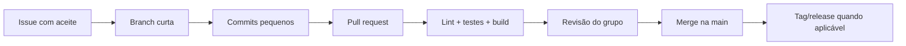

# Versionamento e colaboração

## 1. Modelo de trabalho

O grupo usará **GitHub Flow**: a branch `main` representa uma versão integrada e executável; todo trabalho ocorre em branch curta e entra por pull request revisado.



## 2. Nomes de branches

| Tipo | Padrão | Exemplo |
| --- | --- | --- |
| Funcionalidade | `feat/<issue>-<resumo>` | `feat/21-previsao-produto` |
| Correção | `fix/<issue>-<resumo>` | `fix/34-deduplicar-pedido` |
| Documentação | `docs/<issue>-<resumo>` | `docs/8-modelo-logico` |
| Infraestrutura | `infra/<issue>-<resumo>` | `infra/40-pubsub-dlq` |
| Experimento | `experiment/<issue>-<resumo>` | `experiment/52-croston` |

Branches não devem durar uma sprint inteira. Mudanças grandes serão separadas em incrementos integráveis.

## 3. Commits convencionais

Formato: `tipo(escopo): descrição no imperativo`.

```text
feat(api): adiciona consulta de previsão por produto
test(domain): cobre reentrega de mensagem processada
fix(bling): renova token antes da expiração
docs(data): registra critérios da classificação xyz
chore(ci): executa testes do cliente Flutter
```

Tipos aceitos: `feat`, `fix`, `test`, `docs`, `refactor`, `perf`, `chore`, `build`, `ci` e `revert`. Não incluir credenciais, arquivos de dados reais ou informações pessoais em commits.

## 4. Pull request

Todo PR deve:

- referenciar issue, objetivo e critérios de aceite;
- ter escopo pequeno o bastante para revisão;
- explicar alteração de contrato, banco ou arquitetura;
- incluir evidências dos testes executados;
- atualizar documentação e `.env.example` quando necessário;
- receber ao menos uma aprovação de integrante que não seja o autor;
- passar pelos checks obrigatórios antes do merge.

Não é permitido push direto na `main` depois que a proteção de branch for habilitada. Use squash merge para manter uma unidade lógica por PR, preservando na descrição as decisões importantes.

## 5. Versionamento de contratos e releases

- API pública permanece em `/api/v1`; mudança incompatível exige `/api/v2` e período de migração;
- tópicos e schemas incluem versão principal, como `inventory.data.ingested.v1`;
- migrações de banco são progressivas e reversíveis quando possível;
- datasets, parâmetros e modelos possuem identificadores próprios, independentes da versão do aplicativo;
- releases usam SemVer (`MAJOR.MINOR.PATCH`) e tag assinada/protegida quando o fluxo estiver configurado.

## 6. Proteções recomendadas no GitHub

- pull request obrigatório para a `main`;
- ao menos uma aprovação e resolução de conversas;
- checks obrigatórios de lint, testes e build;
- branch atualizada antes do merge;
- varredura de segredos e dependências;
- exclusão automática da branch após merge;
- releases e ambientes de produção limitados a responsáveis definidos.

## 7. Gestão de experimentos de mineração

Código, configuração e notebooks limpos são versionados no Git. Dados grandes e artefatos de modelo ficam no armazenamento de objetos e são referenciados por URI, versão e hash. Notebooks entregues devem executar do início ao fim sem estado oculto e exportar métricas para `model_runs`.
